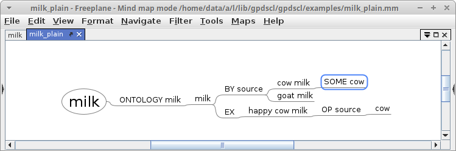
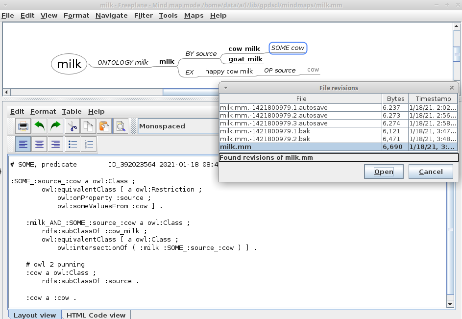
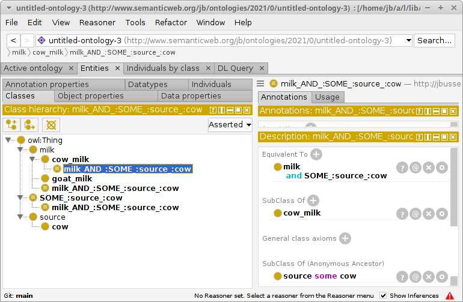

---
jupytext:
  formats: ipynb,md:myst
  text_representation:
    extension: .md
    format_name: myst
    format_version: 0.12
    jupytext_version: 1.6.0
kernelspec:
  display_name: Python 3
  language: python
  name: python3
---

# Mimimal GPDSCL Example

## Set up your workplace

You have just  opened this file `minimal_example.md` in jupyter. (Note that this `.md` file is paired with a `.ipynb` file. Therefore, in jupyter, it makes no difference which file you choose to open). 


Additionally, please open the minimal example ontology `./src/examples/milk_plain.mm` in freeplane.



So far, this ".mm" file is an ordinary plain text mindmap. Now, do some edits, e.g. add another animal milk, e.g.

    goat milk

Save the mindmap in your own local work directory, i.e. `./mindmaps/milk.mm`. 

+++

## The main loop

We assume that you have done some edits to your mindmap.

### Run main_loop.ipynb

To export the mindmap, simply process *the main loop*. To do so:
* In jupyter, open the notebook {doc}```main_loop.ipynb```.
  * Note that this file also operates on the milk example.
  * To work with another mindmap, locate the codeline `project = 'milk'` and assign your own project name.
* Run this notebook in jupyter.

The main loop will call `mm2ttl.py`, which does all the work. As a result, you will get:
* a backup of your input file, located in the directory `./backups/<your_project_name>/<your_project_name>_<timestamp>.mm`
* various  versions of the ontology, located in the directory `./ontologies`
* a new version of your input file

### View results in freeplane

Go back to freeplane, and reload your current mindmap: `File -> Reload from local history`. (To define a hot key for reloading the current map, you may want to use `Tools -> Assign hot key` ). 

Depending on your local settings you get a view similar to this:



(To get rid of the ugly yellow icons, uncheck View -> Notes > Show Note Icons.)

Key interaction features:
* OWL-code is imputed directly into the mindmap. This allows for a simple, fast and transparent 1:1 monitoring of the locally generated code. (To toggle the Note Panel, hit `CTRL Greater`.)
* The mindmap nodes are colorized according to their semantic role.
* Code generation starts with nodes containing "ONTOLOGY ...". You may also have other large subtrees in your mindmap with other non-ontology information.

### Inspect results in Protegé:



## Inferencing

The mindmap contains the following subtree:

    milk
      EX
        happy_cow_milk
	  OP source
	    cow

This subtree is exported to the following  two triples (c.f. `milk_rdflib.ttl`):

    :happy_cow_milk
      a :milk ;
      :source :cow .

Inferencing with [owl-rl](https://owl-rl.readthedocs.io/en/latest/) yields the following information about *happy cow milk*:

    :happy_cow_milk
      a _:ub3bL32C29,
        _:ub3bL38C29,
        :SOME_:source_:cow,
        :cow_milk,
        :milk,
        :milk_AND_:SOME_:source_:cow,
        owl:Thing ;
      :source :cow ;
      owl:sameAs :happy_cow_milk .

As you can see, the instance *happy cow milk* will be classified as an element of the class *cow milk*. This nontrivial inference is based on the somewhat complex code generation of BY-SOME patterns, here:

    :SOME_:source_:cow
        a owl:Class ;
        owl:equivalentClass [ a owl:Restriction ;
            owl:onProperty :source ;
            owl:someValuesFrom :cow ] .

    :milk_AND_:SOME_:source_:cow
        a owl:Class ;
        rdfs:subClassOf :cow_milk ;
        owl:equivalentClass [ a owl:Class ;
            owl:intersectionOf ( :milk :SOME_:source_:cow ) ] .

    # owl 2 punning
    :cow
        a owl:Class ;
        rdfs:subClassOf :source .
        
    :cow
        rdf:type owl:NamedIndividual ;
        a :cow .
